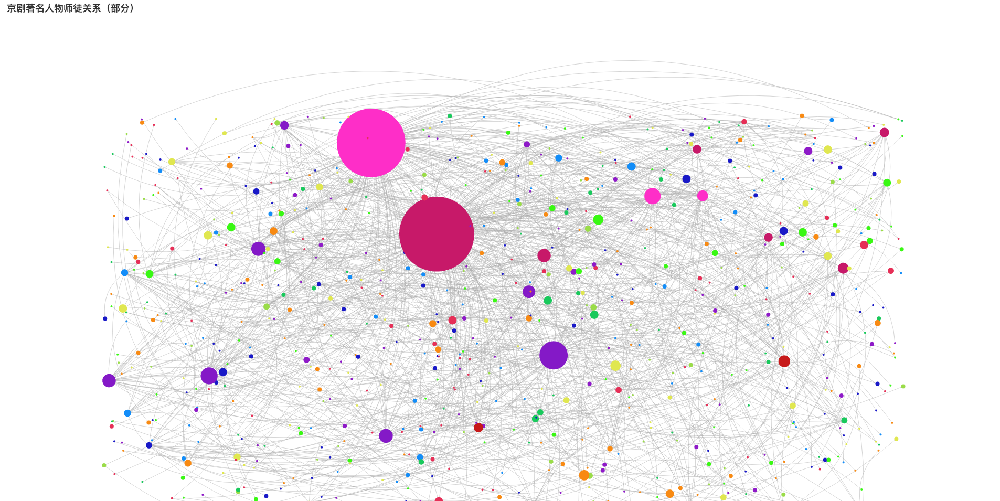
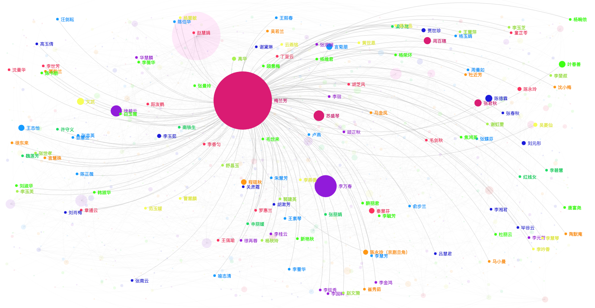
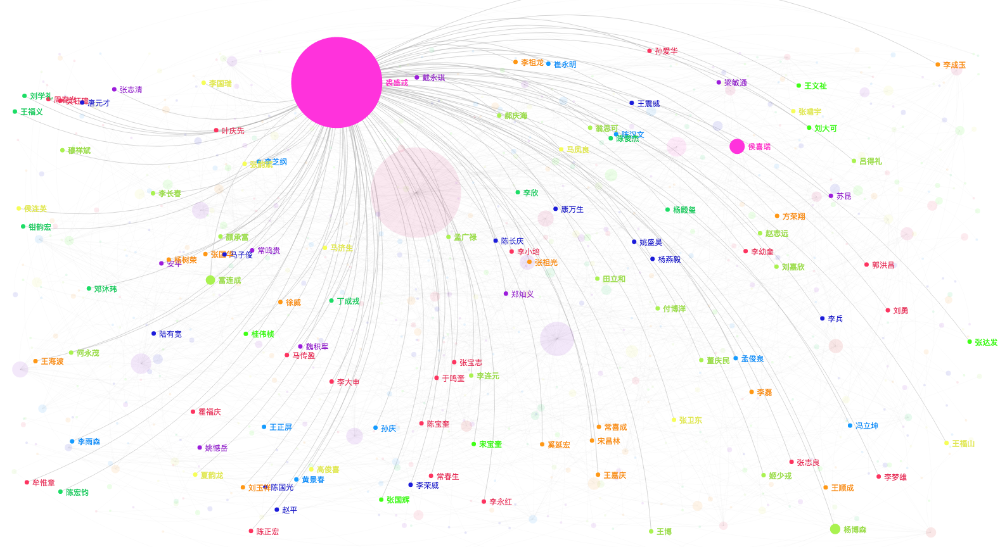
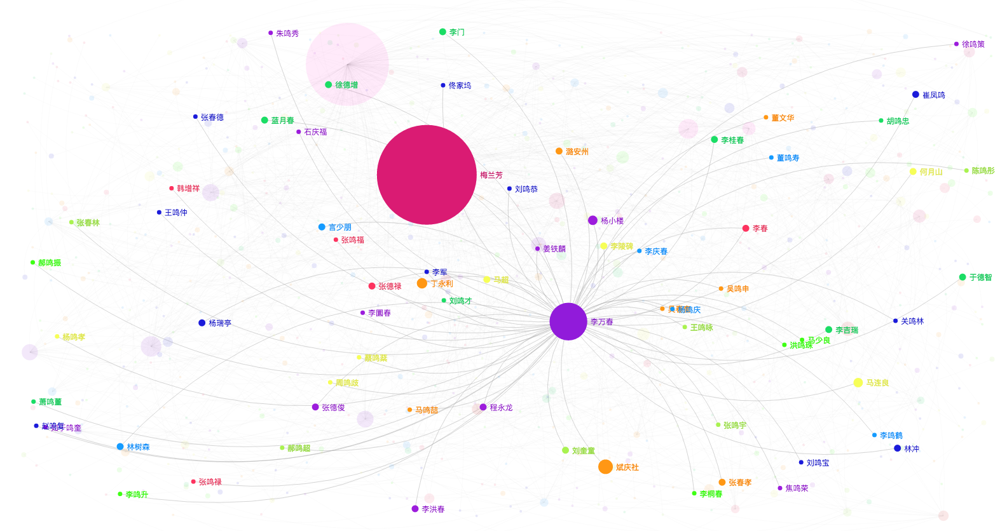

# info-extraction
## 简介
info-extraction项目实现了从[戏考网](http://www.xikao.com)爬取关于京剧名家的介绍，并抽取出介绍的人名以及相互之间的关系。

## 环境配置

* IDE: Eclipse Java EE IDE for Web Developers Neon Release (4.6.0)
* Java: 1.8
* Maven：3.2.5

### 导入步骤

1. File --> Import... --> Existing Maven Project --> info-extraction/pom.xml
2. info-extraction 项目右键 --> Maven --> update project(这里用到了Stanford NLP工具包，文件较大需要下载一定的时间)


## 运行

### 网络爬虫

运行info-extraction/src/main/java/com/corp/myxof/experiment/Experiment1.java文件，抓取到的网页默认保存在info-extraction/data/web-content.xml

```
package com.corp.myxof.experiment;

import java.io.IOException;
import com.corp.myxof.web.Crawler;

public class Experiment1 {
	public static void main(String[] args) throws IOException {
		Crawler crawler = new Crawler();
		crawler.service();
	}
}
```

其中爬取的网页数量和爬取的起始URL可以在info-extraction/src/main/java/com/corp/myxof/config/InfoExtractionConfig.java中修改

```
public static final String START_URL = "http://history.xikao.com/person/梅兰芳";
public static final String START_PERSON = "梅兰芳";
public static final int MAX_WEB_NUM = 1000;
```

最后实验结果

```
<performer name="朱锦华" url="http://history.xikao.com/person/朱锦华">人物：朱锦华 ...</performer>
<performer name="朱天祥" url="http://history.xikao.com/person/朱天祥">人物：朱天祥 ...</performer>
<performer name="马艳云" url="http://history.xikao.com/person/马艳云">人物：马艳云 ...</performer>
```

### 命名实体识别

运行info-extraction/src/main/java/com/corp/myxof/experiment/Experiment2.java文件，extractor实例的getAllNameInContent方法需要接受一个参数，指定输入文件的路径，默认采用第一步生成的info-extraction/data/web-content.xml，命名实体的结果默认保存在info-extraction/data/people.xml

```
package com.corp.myxof.experiment;

import java.io.IOException;
import org.dom4j.DocumentException;
import com.corp.myxof.config.InfoExtractionConfig;
import com.corp.myxof.relation.RelationshipExtractor;

public class Experiment2 {

	public static void main(String[] args) throws IOException, DocumentException {
		RelationshipExtractor extractor = new RelationshipExtractor();
		extractor.init();
		extractor.getAllNameInContent(InfoExtractionConfig.PERFORMER_FILE);
	}

}
```

最后实验结果

```
<performer name="李吉来">
	<name>李吉来</name>
	<name>陈鹤昆</name>
</performer>
<performer name="李韵章">
	<name>赵春瑞</name>
	<name>夏韵龙</name>
	<name>李喜璋</name>
	<name>蔡宝华</name>
	<name>李韵章</name>
</performer>
<performer name="张元志">
	<name>张元奎</name>
	<name>张元志</name>
	<name>蔡宝华</name>
</performer>
```

### 实体关系抽取

运行info-extraction/src/main/java/com/corp/myxof/experiment/Experiment3.java文件，extractor实例的getAllRelationShipInContent方法需要接受一个参数，指定输入文件的路径，默认采用第一步生成的info-extraction/data/web-content.xml，实体关系抽取的结果默认保存在info-extraction/data/relationship.xml

```
package com.corp.myxof.experiment;

import java.io.IOException;
import org.dom4j.DocumentException;
import com.corp.myxof.config.InfoExtractionConfig;
import com.corp.myxof.relation.RelationshipExtractor;

public class Experiment3 {

	public static void main(String[] args) throws IOException, DocumentException {
		RelationshipExtractor extractor = new RelationshipExtractor();
		extractor.init();
		extractor.getAllRelationShipInContent(InfoExtractionConfig.PERFORMER_FILE);
	}

```

最后实验结果，其中

* master标签表示这个人是主人公的师傅
* apprentice标签表示这个人是主人公的徒弟
* family标签表示这个人是主人公的亲戚
* partner标签表示这个人和主人公有过合作


```
<performer name="钟连鸣">
	<master>蔡天化</master>
	<master>叶福海</master>
</performer>
	<performer name="孟丽君">
	<family>刘少春</family>
	<family>孟喜平</family>
	<partner>唐韵笙</partner>
</performer>
<performer name="余紫云">
	<master>梅巧玲</master>
	<apprentice>李丙莘</apprentice>
	<family>余慧清</family>
	<family>果湘林</family>
	<family>余叔岩</family>
	<partner>李铁</partner>
</performer>
```

### 实体关系抽取准确性测试

运行info-extraction/src/main/java/com/corp/myxof/experiment/Experiment4.java文件，extractor实例的getAllRelationToFile方法需要接受两个参数，第一个指定输入文件夹的路径，第二个指定生成文件的路径。这里要注意的是：**用于测试的文件夹下应当包含多个文件，且文件名应该是该人物的名字，在示例中people-introduction文件夹下包含四个文件，分别是京剧“四大名旦”的名字**

```
package com.corp.myxof.experiment;

import java.io.IOException;
import org.dom4j.DocumentException;
import com.corp.myxof.relation.RelationshipExtractor;

public class Experiment4 {

	public static void main(String[] args) throws DocumentException, IOException {
		RelationshipExtractor extractor = new RelationshipExtractor();
		extractor.init();
		extractor.getAllRelationToFile("people-introduction", "result");
	}
}
```

## 结果

最终结果采用了了[ECharts](http://echarts.baidu.com)，对部分师徒关系进行了可视化分析。更多可以参考info-extraction、webpage/index.html


<center>京剧人物师徒关系(部分)</center>


<center>梅兰芳师徒关系</center>


<center>裘盛戎师徒关系</center>


<center>李万春师徒关系</center>
